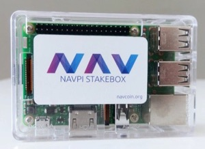

This is the official github repository for the NavCoin Stake Box. This repository is the source code behind the raspberry pi image which runs the navcoin daemon and a PHP based web wallet.

**Current Version:** v1.0.8

You can download the raspberry pi image from our website:

http://www.navcoin.org/downloads

Below are some basic security configurations which you might want to implement when setting up your NavPi. The NavPi will work immediately if you simply burn the img to the SD card, plug it into your network and turn it on.

## Flashing the image to your SD Card

If you purchased your NavPi from our store, you can skip straight to the [setup section](#setup) since we have already flashed the NavPi image onto the device for you.

### OSX

- Format the SD card choosing FAT (MSDOS) format and GUID Partition Map Schema.
- Download and install Etcher: https://etcher.io
- Follow Etchers instructions on how to burn the Nav Pi img to the SD Card.

### Windows & Linux

These should be straight forward, just follow the official documentation:

https://www.raspberrypi.org/documentation/installation/installing-images

## Defaults

| Item         | Value        |
|:-------------|:-------------|
| Unix Username | pi |
| Unix Password | navpi101 |
| Web Password  | nav |

Because we ship the image with some default settings, we do recommend taking the following precautions.

## Setup

SSH is disabled for security purposes, so any configuration you want to do must be done directly on the device.

- Plug in Screen, Keyboard & Mouse.
- Power on Raspberry Pi.

## Enable WiFi

It is recommended to use Ethernet as WiFi can be very slow to sync, but if you must use WiFi you can set it up via the graphical user interface on the device.

- Boot to the Raspberry Pi GUI Operating System.
- Right click on the network icon in the top right task bar.
- Add your WiFi configuration.

## Lock Down NavPi Web Access to local IP Addresses

The NavPi is already locked down to ip address ranges:

192.168.x.x
172.16.x.x
10.10.x.x

This should prevent anyone accessing the Web UI from outside of your local network. If your local network is on a different IP range to these defaults or you want to lock web access down to a particular IP address, then do the following:

- Boot to the Raspberry Pi GUI Operating System.
- Open Terminal.
- In terminal type `sudo leafpad /etc/apache2/sites-available/navpi.conf` and press enter.
- Find the `<VirtualHost *:443>` section.
- Add, Remove or Modify the lines `Require ip XXX.XXX` to be the IP address or range you want to allow.
- Save and close the file.
- In terminal type `sudo service apache2 reload` and press enter.

## Change the Default Unix Password

- Boot to the Raspberry Pi GUI Operating System.
- Open Terminal.
- In terminal type `passwd` and press enter.
- Enter `navpi101` as the current password.
- Enter your new password.
- Confirm your new password.
- Write down your new password.

## Create a new SSL certificate

The NavPi ships with a default ssl cetificate installed, but you will want to generate a new one when you set it up.

Open terminal and paste in the following command:

`sudo openssl req -x509 -nodes -days 3650 -newkey rsa:2048 -out /etc/apache2/ssl/navpi-ssl.crt -keyout /etc/apache2/ssl/navpi-ssl.key`

When you're prompted, fill in each of the details with your own or just press the enter key as these details are not required for a privately used ssl key.

Once you've generated the ssl key we need to flush and reload apache:

`sudo systemctl daemon-reload`

`sudo service apache2 reload`

Whenever you browse to your NavPi's ip address, it will force HTTPS using this new certificate.

Since it's a self signed certificate, your browser will still complain that it is insecure, but all communication to the NavPi through your browser will be encrypted so no one can intercept your passwords.

## Find the IP Address of your NavPi

- Boot to the Raspberry Pi GUI Operating System.
- Open Terminal.
- In terminal type `ifconfig` and press enter.
- Find your `inet addr` (eg. 192.168.1.99).
- Using the computer on your network which you've granted IP access to, open your web browser (Firefox, Chrome, Internet Explorer, Safari).
- In the address bar of your internet browser type in the inet address discovered by ifconfig on the raspberry pi.
- Log into the NavPi Web Interface using the default password `nav`.

## Change the Default Web Interface Password

- Log into the Web Interface of the NavPi.
- Click on the `Control` menu item
- In the `Server` section, click the `Change UI Password` button.
- Type in your new password.
- Confirm your new password.
- Write down your new password.

## Encrypt Your wallet

- Log into the Web Interface of the NavPi.
- Click on the `Control` menu item.
- In the `Security` section, type your desired password into the text field next to the `Encrypt Wallet` button.
- Press enter, or click the `Encrypt Wallet` button.
- Write down your new password.

## Unlock for staking

Whenever you reboot your device, you need to make sure it is unlocked for staking to earn your rewards.

- Log into the Web Interface of the NavPi.
- On the home page click the button that says `Your Wallet Is Locked, Click To Change`.
- Enter your password into the box next to where it says `Unlock for Staking Only`.
- Press enter, or click the `Unlock for Staking Only` button.
- Go back to the home page and the button should now say `Your Wallet Is Unlocked For Staking, Click To Change`.
- You are all ready to earn staking rewards now.

# Backup your wallet

- Log into the Web Interface of the NavPi.
- Click on the `Control` menu item.
- In the `Security` section, click the `Backup Wallet` button.
- This will download to your computer.
- Make multiple backups to protect against data corruption.

# Restoring your wallet

- Boot to the Raspberry Pi GUI Operating System.
- Open Terminal.
- Drag the wallet.dat file from your USB memory stick to the desktop of your navpi.
- Type the command `sudo mv /home/pi/Desktop/wallet.dat /home/stakebox/.navcoin4/wallet.dat` and press enter.
- Type in your sudo password or if you haven't changed it `navpi101` and press enter.
- Change ownership of the wallet.dat file so the user running the navcoin daemon can access it.
- Type the command `sudo chown www-data:www-data /home/stakebox/.navcoin4/wallet.dat` and press enter.
- Type the command `sudo chmod 600 /home/stakebox/.navcoin4/wallet.dat` and press enter.
- Reboot the navpi by typing `sudo reboot now` and pressing enter

## Creating a backup image

Once you've done all this setup, it is worth making a backup image of the SD card so if it fails, you can easily restore to this point.

### OSX

- Create a .dmg of the whole SD Card using disk utility.
- Convert the dmg to an img from terminal:
`hdiutil convert foo.dmg -format UDTO -o bar.img`

This .img file can now be burned to a new SD Card using Etcher.

## Updating the User Interface

- Boot to the Raspberry Pi GUI Operating System.
- Open Terminal.
- Type `cd /home/stakebox/UI` and press enter.
- Type `git pull` and press enter.
- You will receive any UI updates.

If you have the latest version of the UI, you should be able to perform future updates by using the update button on the control page.

## Updating the NavCoin Daemon

If you're upto date with the latest UI, you can run the following script manually:
- `/home/stakebox/UI/libs/updater.sh`
- Or you can add it to your sudo crontab to automatically check for and install new updates

License
---------------------
Distributed under the [MIT software license](http://www.opensource.org/licenses/mit-license.php).
